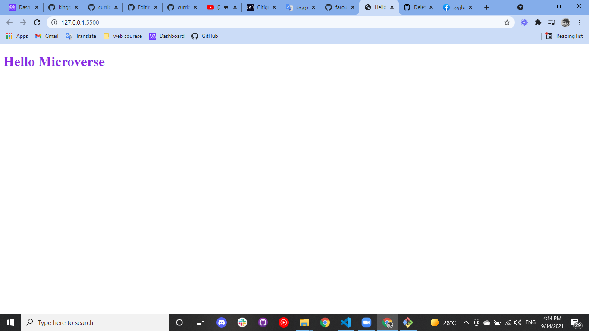

# Hello Microverse

> n this project, I will set up a "Hello world" repository. No complex coding is required for this project . My goal here is to master all of the tools git and git hup  

Additional description about the project and its features.

## Built With

- Major languages:Html and CSS
- Technologies used :GIT and GitHup 

## Getting Started

To get a local copy up and running follow these simple example steps.

1.Open the terminal
2.Run git clone https://github.com/MahmoudBakr23/Hello-Microverse.git
3.Then run git checkout feature
Now you can open the index.html file in your browser

👤 **Author1**

- GitHub: [@githubhandle](https://github.com/githubhandle)
- Twitter: [@twitterhandle](https://twitter.com/twitterhandle)
- LinkedIn: [LinkedIn](https://linkedin.com/in/linkedinhandle)

## 🤝 Contributing

Contributions, issues, and feature requests are welcome!

Feel free to check the [issues page](../../issues/).

## Show your support

Give a ⭐️ if you like this project!

